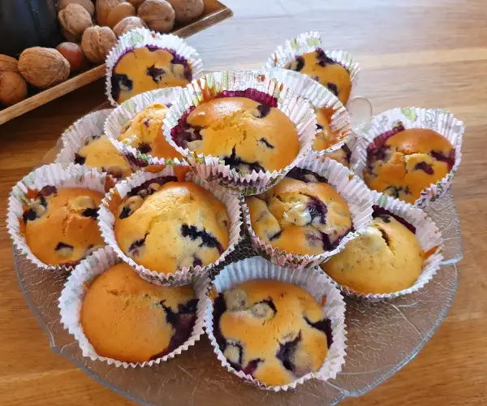
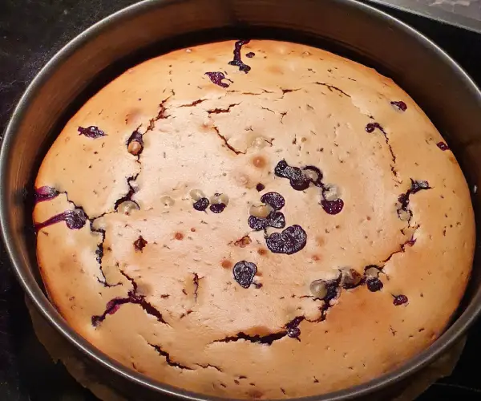

# Blueberry Muffins

- ⏲️ Prep time: 20 min
- 🍳 Baking time: 20 min
- 🍽️ Servings: 12

## Equipment

-At least 12 muffin tins / A cake tin and optionally a hand mixer

## Ingredients

- 250g / 9 oz Blueberries 
- 125g / 4½ oz Butter*
- 150g / 5½ oz Sugar (Of course  you can lower the amount to your liking)
- 1 Vanilla Pod or Teaspoon of vanilla sugar
- 2 Eggs
- 125ml / 4.22 fluid ounces of Milk
- 300g /  11 oz Flour
- 2 Teaspoons of Backing Powder
- 125g / 4½ oz Powdered sugar (optional)
- Half a lemon (optional)

*If you don't have Butter, you can substitute it with 100g of Oil / 3½ oz of Oil suited for baking. Notice the measurement in grams / ounces and not milliliter and fluid ounces

## Directions

1. If using a vanilla pod, wash it with water, extract it's vanilla and add it to the molten butter. Put the now empty vanilla pod into the milk. This way every single bit of the vanilla gets extracted
2. Wash the blueberries
3. For the liquid ingredients, melt the butter, do not cook it
4. Add the extracted vanilla / vanilla sugar to the molten butter
5. Add the milk to the molten butter. Take the vanilla pod out of the milk if you have used one before adding it
6. Add the two eggs to the molten butter, no need to separate yolk from the egg white
7. Add the sugar to the molten butter
8. Mix the aforementioned ingredients up
9. For the dry ingredients, add the baking powder and salt to the flour
10. Mix both the liquid ingredients with the dry ingredients, the dough should be thick enough to not be completely fluid but also be just fluid enough to be easily distributed across the muffin tins
11. The blueberries should have lost most of the water from washing by now, carefully mix them into the dough
12. Distribute the dough across the muffin tins and put them into the preheated oven (190°C / 375°F), the muffins should be ready after 20 minutes
13. Extract the juice of the lemon and slowly add it to the powdered sugar. Mix it with a whisk until you get a thick mass (optional)
14. Distribute the coating across the top of the muffins and let them cool (optional)

## Cool Tip:
Muffins are great for sharing at gatherings, but you don't necessary have to waste time and resources on muffin tins. You can always just pour the dough into a cake tin! However, keep in mind that the baking temperature and time should be adjusted. For me 150°C / 300°F for 50 mins. worked the best. 

## What else to do?

- My stuff - [website](https://alexplatonov.com), [donate](https://alexplatonov.com/donate)
- Pictures taken by me
